# Cipta — Entity-Relationship Diagram & Database Schema

> **Version:** 0.1.0-alpha  
> **Status:** Draft  
> **ORM:** Prisma (PostgreSQL 16+)  
> **Package:** `packages/database`  
> **Last Updated:** 2026-04-11

---

## 1. ER Diagram

```mermaid
erDiagram
    User ||--o{ WorkspaceMember : "belongs to"
    Workspace ||--o{ WorkspaceMember : "has"
    Workspace ||--o{ Source : "owns"
    Workspace ||--o{ Project : "owns"
    Workspace ||--o{ Account : "owns"
    Workspace ||--o{ Cluster : "owns"
    Workspace ||--o{ RenderProfile : "owns"

    Project ||--o{ Source : "contains"
    Source ||--o{ Transcript : "has"
    Source ||--o{ Chunk : "produces"

    Transcript ||--o{ ViralSpike : "contains"
    ViralSpike ||--o| Chunk : "becomes"

    Chunk ||--o{ Asset : "rendered into"
    Asset ||--o{ Variation : "generates"
    Asset ||--o{ Distribution : "distributed via"

    RenderProfile ||--o{ Asset : "configures"

    Cluster ||--o{ ClusterAccount : "contains"
    Account ||--o{ ClusterAccount : "belongs to"
    Cluster ||--o{ DistributionRule : "governed by"

    Account ||--o{ Distribution : "publishes to"
    Variation ||--o{ Distribution : "published as"

    User {
        uuid id PK
        string email UK
        string passwordHash
        string displayName
        datetime createdAt
        datetime updatedAt
    }

    Workspace {
        uuid id PK
        string name
        string slug UK
        enum plan
        jsonb settings
        datetime createdAt
        datetime updatedAt
    }

    WorkspaceMember {
        uuid id PK
        uuid userId FK
        uuid workspaceId FK
        enum role
        datetime joinedAt
    }

    Project {
        uuid id PK
        uuid workspaceId FK
        string name
        string description
        datetime createdAt
        datetime updatedAt
    }

    Source {
        uuid id PK
        uuid workspaceId FK
        uuid projectId FK
        string url
        string title
        string platform
        enum status
        int durationSeconds
        string thumbnailUrl
        string storagePath
        jsonb metadata
        datetime createdAt
        datetime updatedAt
    }

    Transcript {
        uuid id PK
        uuid sourceId FK
        jsonb words
        string language
        enum status
        datetime createdAt
    }

    ViralSpike {
        uuid id PK
        uuid transcriptId FK
        float startTime
        float endTime
        int confidenceScore
        enum category
        string suggestedTitle
        enum status
        datetime createdAt
    }

    Chunk {
        uuid id PK
        uuid sourceId FK
        uuid viralSpikeId FK
        float startTime
        float endTime
        string storagePath
        enum status
        datetime createdAt
    }

    RenderProfile {
        uuid id PK
        uuid workspaceId FK
        string name
        jsonb captionStyle
        jsonb brollConfig
        jsonb frameConfig
        boolean isDefault
        datetime createdAt
        datetime updatedAt
    }

    Asset {
        uuid id PK
        uuid chunkId FK
        uuid workspaceId FK
        uuid renderProfileId FK
        string storagePath
        string storageUrl
        int fileSizeBytes
        int durationMs
        int width
        int height
        string codec
        enum status
        datetime createdAt
    }

    Variation {
        uuid id PK
        uuid assetId FK
        string md5Hash UK
        string storagePath
        string storageUrl
        jsonb guardianParams
        int fileSizeBytes
        enum status
        datetime createdAt
    }

    Account {
        uuid id PK
        uuid workspaceId FK
        string platform
        string platformAccountId
        string displayName
        string avatarUrl
        jsonb credentials
        enum status
        datetime lastActiveAt
        datetime createdAt
        datetime updatedAt
    }

    Cluster {
        uuid id PK
        uuid workspaceId FK
        string name
        string description
        string niche
        uuid defaultRenderProfileId FK
        datetime createdAt
        datetime updatedAt
    }

    ClusterAccount {
        uuid id PK
        uuid clusterId FK
        uuid accountId FK
        datetime addedAt
    }

    DistributionRule {
        uuid id PK
        uuid clusterId FK
        uuid renderProfileId FK
        jsonb scheduleConfig
        int cooldownMinutes
        boolean autoPin
        string pinnedCommentTemplate
        boolean isActive
        datetime createdAt
        datetime updatedAt
    }

    Distribution {
        uuid id PK
        uuid variationId FK
        uuid accountId FK
        uuid workspaceId FK
        string platformPostId
        string platformPostUrl
        string caption
        string pinnedComment
        enum status
        datetime scheduledAt
        datetime publishedAt
        int retryCount
        string lastError
        datetime createdAt
        datetime updatedAt
    }

    Job {
        uuid id PK
        uuid workspaceId FK
        string queue
        string type
        string bullJobId
        enum status
        int progress
        jsonb payload
        jsonb result
        string error
        int attemptsMade
        datetime startedAt
        datetime completedAt
        datetime createdAt
    }
```



---

## 2. Prisma Schema

This is the canonical schema to be placed at `packages/database/prisma/schema.prisma`.

```prisma
// packages/database/prisma/schema.prisma

generator client {
  provider = "prisma-client-js"
  output   = "../src/generated/client"
}

datasource db {
  provider = "postgresql"
  url      = env("DATABASE_URL")
}

// ─────────────────────────────────────
// ENUMS
// ─────────────────────────────────────

enum WorkspacePlan {
  FREE
  PRO
  ENTERPRISE
}

enum WorkspaceRole {
  OWNER
  ADMIN
  MEMBER
}

enum SourceStatus {
  PENDING
  DOWNLOADING
  DOWNLOADED
  TRANSCRIBING
  ANALYZING
  READY
  FAILED
}

enum TranscriptStatus {
  PENDING
  PROCESSING
  COMPLETED
  FAILED
}

enum ViralSpikeCategory {
  HUMOR
  CONTROVERSY
  HOOK
  EMOTIONAL
  EDUCATIONAL
  OTHER
}

enum ViralSpikeStatus {
  PENDING_REVIEW
  APPROVED
  REJECTED
}

enum ChunkStatus {
  PENDING
  EXTRACTING
  READY
  FAILED
}

enum AssetStatus {
  PENDING
  RENDERING
  RENDERED
  FAILED
}

enum VariationStatus {
  PENDING
  PROCESSING
  READY
  FAILED
}

enum AccountPlatform {
  TIKTOK
  INSTAGRAM
  YOUTUBE
  TWITTER
  FACEBOOK
}

enum AccountStatus {
  ACTIVE
  RATE_LIMITED
  SUSPENDED
  DISCONNECTED
}

enum DistributionStatus {
  SCHEDULED
  PUBLISHING
  PUBLISHED
  FAILED
  CANCELLED
}

enum JobStatus {
  QUEUED
  ACTIVE
  COMPLETED
  FAILED
  STALLED
}

// ─────────────────────────────────────
// MODELS
// ─────────────────────────────────────

model User {
  id           String   @id @default(uuid()) @db.Uuid
  email        String   @unique
  passwordHash String
  displayName  String
  createdAt    DateTime @default(now())
  updatedAt    DateTime @updatedAt

  workspaces WorkspaceMember[]

  @@map("users")
}

model Workspace {
  id        String        @id @default(uuid()) @db.Uuid
  name      String
  slug      String        @unique
  plan      WorkspacePlan @default(FREE)
  settings  Json          @default("{}")
  createdAt DateTime      @default(now())
  updatedAt DateTime      @updatedAt

  members        WorkspaceMember[]
  projects       Project[]
  sources        Source[]
  accounts       Account[]
  clusters       Cluster[]
  renderProfiles RenderProfile[]
  assets         Asset[]
  distributions  Distribution[]
  jobs           Job[]

  @@map("workspaces")
}

model WorkspaceMember {
  id          String        @id @default(uuid()) @db.Uuid
  userId      String        @db.Uuid
  workspaceId String        @db.Uuid
  role        WorkspaceRole @default(MEMBER)
  joinedAt    DateTime      @default(now())

  user      User      @relation(fields: [userId], references: [id], onDelete: Cascade)
  workspace Workspace @relation(fields: [workspaceId], references: [id], onDelete: Cascade)

  @@unique([userId, workspaceId])
  @@map("workspace_members")
}

model Project {
  id          String   @id @default(uuid()) @db.Uuid
  workspaceId String   @db.Uuid
  name        String
  description String?
  createdAt   DateTime @default(now())
  updatedAt   DateTime @updatedAt

  workspace Workspace @relation(fields: [workspaceId], references: [id], onDelete: Cascade)
  sources   Source[]

  @@index([workspaceId])
  @@map("projects")
}

model Source {
  id              String       @id @default(uuid()) @db.Uuid
  workspaceId     String       @db.Uuid
  projectId       String?      @db.Uuid
  url             String
  title           String?
  platform        String?
  status          SourceStatus @default(PENDING)
  durationSeconds Int?
  thumbnailUrl    String?
  storagePath     String?
  metadata        Json         @default("{}")
  createdAt       DateTime     @default(now())
  updatedAt       DateTime     @updatedAt

  workspace   Workspace    @relation(fields: [workspaceId], references: [id], onDelete: Cascade)
  project     Project?     @relation(fields: [projectId], references: [id], onDelete: SetNull)
  transcripts Transcript[]
  chunks      Chunk[]

  @@index([workspaceId])
  @@index([workspaceId, status])
  @@map("sources")
}

model Transcript {
  id       String           @id @default(uuid()) @db.Uuid
  sourceId String           @db.Uuid
  words    Json             // Array of { word: string, start: number, end: number }
  language String           @default("en")
  status   TranscriptStatus @default(PENDING)
  createdAt DateTime        @default(now())

  source      Source       @relation(fields: [sourceId], references: [id], onDelete: Cascade)
  viralSpikes ViralSpike[]

  @@index([sourceId])
  @@map("transcripts")
}

model ViralSpike {
  id              String             @id @default(uuid()) @db.Uuid
  transcriptId    String             @db.Uuid
  startTime       Float
  endTime         Float
  confidenceScore Int                // 0-100
  category        ViralSpikeCategory
  suggestedTitle  String?
  status          ViralSpikeStatus   @default(PENDING_REVIEW)
  createdAt       DateTime           @default(now())

  transcript Transcript @relation(fields: [transcriptId], references: [id], onDelete: Cascade)
  chunk      Chunk?

  @@index([transcriptId])
  @@map("viral_spikes")
}

model Chunk {
  id           String      @id @default(uuid()) @db.Uuid
  sourceId     String      @db.Uuid
  viralSpikeId String?     @unique @db.Uuid
  startTime    Float
  endTime      Float
  storagePath  String?
  status       ChunkStatus @default(PENDING)
  createdAt    DateTime    @default(now())

  source     Source      @relation(fields: [sourceId], references: [id], onDelete: Cascade)
  viralSpike ViralSpike? @relation(fields: [viralSpikeId], references: [id], onDelete: SetNull)
  assets     Asset[]

  @@index([sourceId])
  @@map("chunks")
}

model RenderProfile {
  id           String   @id @default(uuid()) @db.Uuid
  workspaceId  String   @db.Uuid
  name         String
  captionStyle Json     @default("{}") // font, size, color, animation, position
  brollConfig  Json     @default("{}") // enabled, sources, keywords
  frameConfig  Json     @default("{}") // aspect ratio, zoom, tracking
  isDefault    Boolean  @default(false)
  createdAt    DateTime @default(now())
  updatedAt    DateTime @updatedAt

  workspace         Workspace          @relation(fields: [workspaceId], references: [id], onDelete: Cascade)
  assets            Asset[]
  clusters          Cluster[]          @relation("ClusterDefaultProfile")
  distributionRules DistributionRule[]

  @@index([workspaceId])
  @@map("render_profiles")
}

model Asset {
  id              String      @id @default(uuid()) @db.Uuid
  chunkId         String      @db.Uuid
  workspaceId     String      @db.Uuid
  renderProfileId String?     @db.Uuid
  storagePath     String?
  storageUrl      String?
  fileSizeBytes   Int?
  durationMs      Int?
  width           Int?
  height          Int?
  codec           String?     @default("h264")
  status          AssetStatus @default(PENDING)
  createdAt       DateTime    @default(now())

  chunk         Chunk          @relation(fields: [chunkId], references: [id], onDelete: Cascade)
  workspace     Workspace      @relation(fields: [workspaceId], references: [id], onDelete: Cascade)
  renderProfile RenderProfile? @relation(fields: [renderProfileId], references: [id], onDelete: SetNull)
  variations    Variation[]

  @@index([workspaceId])
  @@index([chunkId])
  @@map("assets")
}

model Variation {
  id             String          @id @default(uuid()) @db.Uuid
  assetId        String          @db.Uuid
  md5Hash        String          @unique
  storagePath    String?
  storageUrl     String?
  guardianParams Json            @default("{}") // zoom, colorShift, bitrate, noiseOpacity
  fileSizeBytes  Int?
  status         VariationStatus @default(PENDING)
  createdAt      DateTime        @default(now())

  asset         Asset          @relation(fields: [assetId], references: [id], onDelete: Cascade)
  distributions Distribution[]

  @@index([assetId])
  @@map("variations")
}

model Account {
  id                String          @id @default(uuid()) @db.Uuid
  workspaceId       String          @db.Uuid
  platform          AccountPlatform
  platformAccountId String
  displayName       String?
  avatarUrl         String?
  credentials       Json            @default("{}") // Encrypted API keys/tokens
  status            AccountStatus   @default(ACTIVE)
  lastActiveAt      DateTime?
  createdAt         DateTime        @default(now())
  updatedAt         DateTime        @updatedAt

  workspace     Workspace        @relation(fields: [workspaceId], references: [id], onDelete: Cascade)
  clusters      ClusterAccount[]
  distributions Distribution[]

  @@unique([workspaceId, platform, platformAccountId])
  @@index([workspaceId])
  @@map("accounts")
}

model Cluster {
  id                     String   @id @default(uuid()) @db.Uuid
  workspaceId            String   @db.Uuid
  name                   String
  description            String?
  niche                  String?
  defaultRenderProfileId String?  @db.Uuid
  createdAt              DateTime @default(now())
  updatedAt              DateTime @updatedAt

  workspace            Workspace          @relation(fields: [workspaceId], references: [id], onDelete: Cascade)
  defaultRenderProfile RenderProfile?     @relation("ClusterDefaultProfile", fields: [defaultRenderProfileId], references: [id], onDelete: SetNull)
  accounts             ClusterAccount[]
  distributionRules    DistributionRule[]

  @@index([workspaceId])
  @@map("clusters")
}

model ClusterAccount {
  id        String   @id @default(uuid()) @db.Uuid
  clusterId String   @db.Uuid
  accountId String   @db.Uuid
  addedAt   DateTime @default(now())

  cluster Cluster @relation(fields: [clusterId], references: [id], onDelete: Cascade)
  account Account @relation(fields: [accountId], references: [id], onDelete: Cascade)

  @@unique([clusterId, accountId])
  @@map("cluster_accounts")
}

model DistributionRule {
  id                    String   @id @default(uuid()) @db.Uuid
  clusterId             String   @db.Uuid
  renderProfileId       String?  @db.Uuid
  scheduleConfig        Json     @default("{}") // time windows, frequency
  cooldownMinutes       Int      @default(30)
  autoPin               Boolean  @default(false)
  pinnedCommentTemplate String?
  isActive              Boolean  @default(true)
  createdAt             DateTime @default(now())
  updatedAt             DateTime @updatedAt

  cluster       Cluster        @relation(fields: [clusterId], references: [id], onDelete: Cascade)
  renderProfile RenderProfile? @relation(fields: [renderProfileId], references: [id], onDelete: SetNull)

  @@index([clusterId])
  @@map("distribution_rules")
}

model Distribution {
  id              String             @id @default(uuid()) @db.Uuid
  variationId     String             @db.Uuid
  accountId       String             @db.Uuid
  workspaceId     String             @db.Uuid
  platformPostId  String?
  platformPostUrl String?
  caption         String?
  pinnedComment   String?
  status          DistributionStatus @default(SCHEDULED)
  scheduledAt     DateTime
  publishedAt     DateTime?
  retryCount      Int                @default(0)
  lastError       String?
  createdAt       DateTime           @default(now())
  updatedAt       DateTime           @updatedAt

  variation Variation @relation(fields: [variationId], references: [id], onDelete: Cascade)
  account   Account   @relation(fields: [accountId], references: [id], onDelete: Cascade)
  workspace Workspace @relation(fields: [workspaceId], references: [id], onDelete: Cascade)

  @@index([workspaceId])
  @@index([workspaceId, status])
  @@index([accountId, scheduledAt])
  @@map("distributions")
}

model Job {
  id           String    @id @default(uuid()) @db.Uuid
  workspaceId  String    @db.Uuid
  queue        String    // e.g., "ingestor-queue"
  type         String    // e.g., "download", "transcribe"
  bullJobId    String?   // BullMQ's internal ID
  status       JobStatus @default(QUEUED)
  progress     Int       @default(0) // 0-100
  payload      Json      @default("{}")
  result       Json?
  error        String?
  attemptsMade Int       @default(0)
  startedAt    DateTime?
  completedAt  DateTime?
  createdAt    DateTime  @default(now())

  workspace Workspace @relation(fields: [workspaceId], references: [id], onDelete: Cascade)

  @@index([workspaceId])
  @@index([workspaceId, status])
  @@index([bullJobId])
  @@map("jobs")
}
```

---

## 3. Key Design Decisions

### 3.1 UUID Primary Keys

All tables use UUIDs (`@default(uuid())`) instead of auto-incrementing integers. Rationale:
- Safe for distributed systems (Worker can generate IDs independently)
- No information leakage about record counts
- Merge-friendly across environments

### 3.2 Workspace Scoping

Every data table (except `User`) includes a `workspaceId` foreign key with a corresponding index. This enforces row-level multi-tenancy. **Every** query and API endpoint MUST include workspace filtering.

### 3.3 JSON Columns for Extensibility

`captionStyle`, `brollConfig`, `frameConfig`, `guardianParams`, `scheduleConfig`, and `credentials` use `Json` columns. These are configuration blobs that change frequently during development. Once schemas stabilize, consider migrating to structured columns or separate tables.

### 3.4 Soft Status Tracking

All processing entities use `enum` status fields instead of soft deletes. The pipeline flow is:

```
Source:  PENDING → DOWNLOADING → DOWNLOADED → TRANSCRIBING → ANALYZING → READY
Chunk:   PENDING → EXTRACTING → READY
Asset:   PENDING → RENDERING → RENDERED
Variation: PENDING → PROCESSING → READY
Distribution: SCHEDULED → PUBLISHING → PUBLISHED
```

Any stage can transition to `FAILED` from any active state.

### 3.5 Index Strategy

Indexes are placed on:
- All `workspaceId` columns (multi-tenancy filter)
- Compound indexes on `(workspaceId, status)` for dashboard queries
- `scheduledAt` for distribution scheduling queries
- Unique constraints on business-logic uniqueness (email, slug, md5Hash, platform+accountId)

---

## 4. Migration Strategy

```bash
# Generate migration after schema changes
pnpm --filter @cipta/database exec prisma migrate dev --name <descriptive_name>

# Apply migrations in production
pnpm --filter @cipta/database exec prisma migrate deploy

# Generate Prisma Client
pnpm --filter @cipta/database exec prisma generate
```

### Migration Naming Convention

```
YYYYMMDDHHMMSS_<descriptive_name>
# Examples:
20260411_init_core_schema
20260415_add_distribution_rules
20260420_add_job_tracking
```
